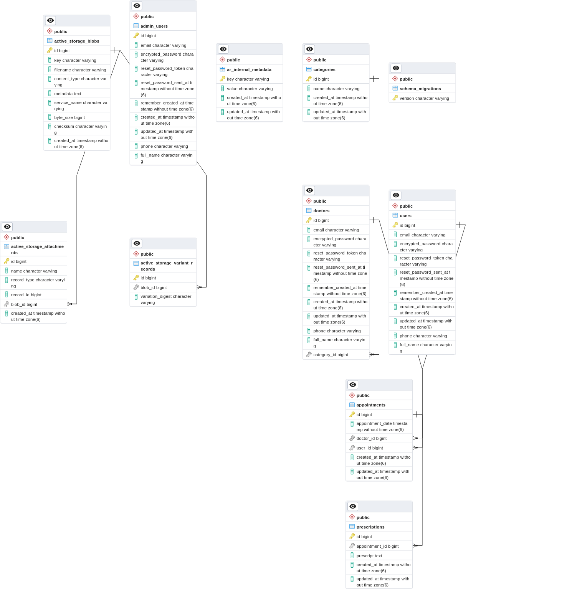
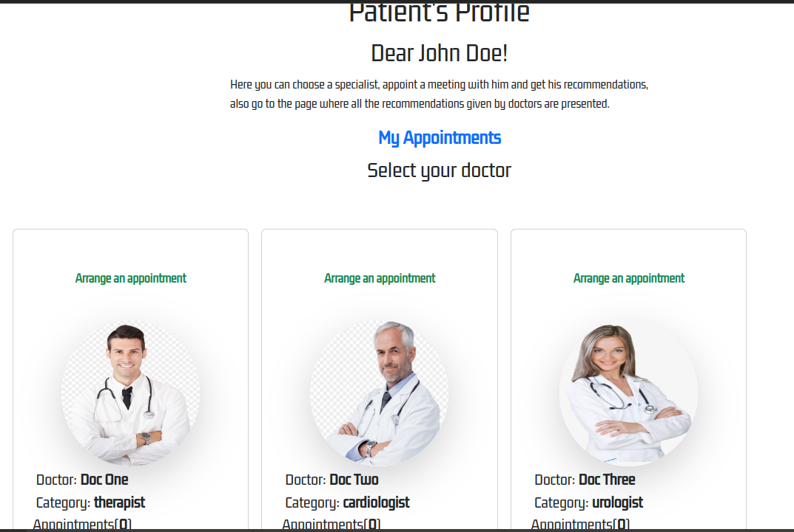
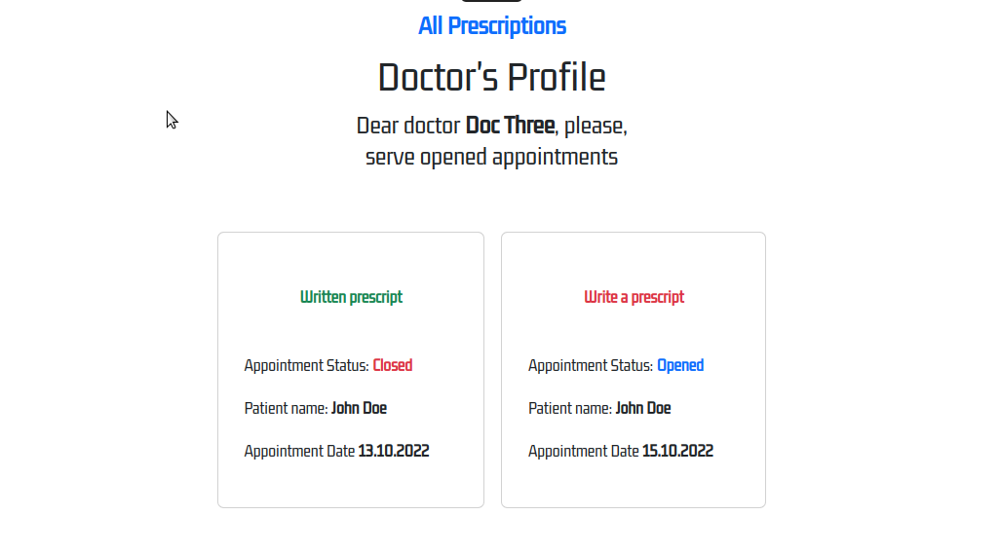
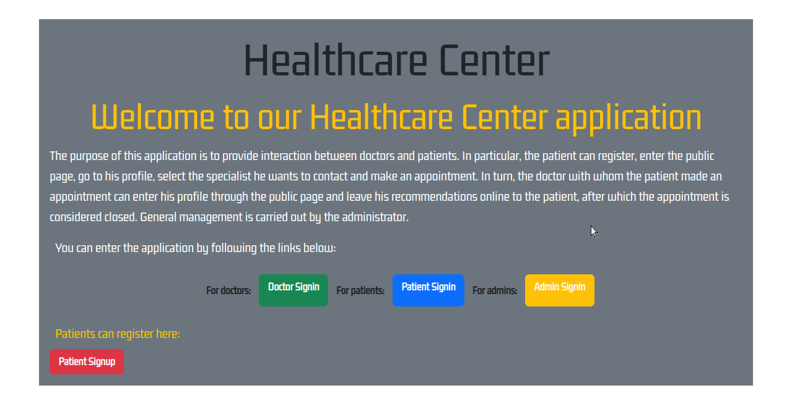

# Healthcare Center

> This Ruby on Rails project implements a medical clinic management system.

It has three types of users: 

- Patient (User)
- Doctor
- Admin

Their possibilities are distributed as follows:

- The patient can register, enter patients Public page and then go to his/her/their personal account (Profile), view a list of doctors by category, make an appointment, and get a doctor's appointment after meeting him.

- The doctor can enter his doctor's Public page and then go to his/her/their personal account (Profile), view the list of patients, which signed up to provide recommendations to the patient. The physician may refer to a specific category (therapist, cardiologist, etc.).

- Admin has access to the list of patients and doctors. Can create categories, doctors, Assign a specific doctor to a category, which is implemented via Administrate.






## Live Demo

[Run if currently available]()

## Built With

- Major languages (Ruby)
- Framworks (Ruby on Rails)

## Getting Started

To get a local copy up and running follow these simple example steps.

## Prerequisites

- A text editor(preferably Visual Studio Code)

## Install

- Ruby
- Ruby on Rails
- PostgresSQL
- Rspec

## Using it Locally

- Clone the project

## Setup

Install gems with:

```
bundle install
```
Setup database with:

```
rails db:create
rails db:migrate
rails db:seed
```
## Usage

Start server with:

```
rails server
```
Open http://localhost:3000/ in your browser.

## Install linter

```bash
bundle install
```
## Run tests

Install rspec with:

```
bundle install
```
and
```
rails generate rspec:install
```
run the test with:
```
rails exec rspec
```
## Visit And Open Files

[Visit Repo](https://github.com/Gegardus/healthcare-center)

## Clone Repo

[Clone Repo](https://github.com/Gegardus/healthcare-center.git)

## Author

👤 **Vahan Khachvankian**

- GitHub: [@githubhandle](https://github.com/Gegardus)
- Twitter: [@twitterhandle](https://twitter.com/Gegardus)
- LinkedIn: [@linkedinhandle](https://www.linkedin.com/in/vahan-khachvankian)

## 🤝 Contributing

Contributions, issues, and feature requests are welcome!

Feel free to check the [issues page](https://github.com/Gegardus/healthcare-center/issues).

## Show your support

Give a ⭐️ if you like this project!
